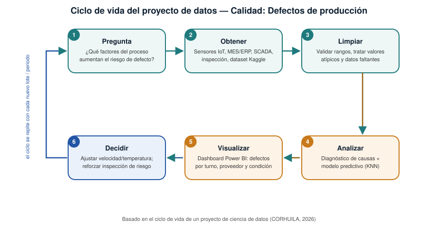

# Actividad Calificable · Corte 1 — Diagnóstico de datos de un proceso
## Calidad: Defectos de producción

**Programa:** Ingeniería Industrial | **Asignatura:** Ciencia de Datos | **Semana del corte:** 4 | **Periodo:** 2026-B | **Entrega:** Individual, por GitHub (fork del repositorio de la clase) | **Valor:** 5.0 | **Estudiante:** Angelica Vargas Zambrano

Esta actividad sintetiza y da cierre al proyecto trabajado en las Semanas 1 a 4 (*Calidad — Defectos de producción*), integrando la pregunta de negocio, el inventario de fuentes, el tipo de analítica y las V del Big Data, y el ciclo de vida completo del proyecto.

---

## 1. Marco de referencia y conceptos

### 1.1 De la pregunta de negocio a la pregunta de datos

Un proyecto de ciencia de datos parte de formular una pregunta de negocio clara y accionable, que luego se traduce en una pregunta de datos verificable con la evidencia disponible (CORHUILA, 2026). La calidad de esa pregunta inicial condiciona todo lo que sigue: qué datos se necesitan, qué tipo de analítica es pertinente y qué decisión, en última instancia, se habilita.

### 1.2 Inventario de datos y clasificación por estructura

Todo proyecto requiere un inventario explícito de sus fuentes de datos, clasificadas según su nivel de estructura en **estructurados** (tablas de filas y columnas fijas), **semiestructurados** (formatos flexibles como JSON o XML) y **no estructurados** (texto libre, imágenes, audio o video), pues cada tipo exige una estrategia distinta de almacenamiento y limpieza (CORHUILA, 2026).

### 1.3 Tipo de analítica y las V del Big Data

Los proyectos de datos se ubican en un espectro de madurez analítica que va de lo descriptivo ("¿qué pasó?") a lo prescriptivo ("¿qué debo hacer?"), y un caso se considera de Big Data cuando su volumen, velocidad, variedad, veracidad o valor superan la capacidad de las herramientas tradicionales (CORHUILA, 2026). Este marco de las cinco V tiene su origen en el trabajo de Laney (2001), quien caracterizó por primera vez el crecimiento de los datos empresariales a lo largo de las dimensiones de volumen, velocidad y variedad, dimensiones a las que luego se sumaron la veracidad y el valor.

### 1.4 Ciclo de vida del proyecto de datos

De acuerdo con el material del curso, un proyecto de ciencia de datos recorre un ciclo de seis etapas: **pregunta → obtener → limpiar → analizar → visualizar → decidir**, que se repite de forma iterativa a medida que llegan nuevos datos (CORHUILA, 2026). Este ciclo es coherente con la metodología CRISP-DM (*Cross-Industry Standard Process for Data Mining*), el estándar de referencia en la industria y la academia para estructurar proyectos de minería de datos y ciencia de datos en fases iterativas de comprensión del negocio, comprensión y preparación de los datos, modelado, evaluación y despliegue (Chapman et al., 2000).

---

## 2. Enunciado de la actividad

### 2.1 Problema real y pregunta de datos

**Problema elegido:** control de calidad en un proceso de manufactura industrial, donde una proporción de las unidades producidas sale defectuosa sin que se sepa con certeza qué condiciones operativas lo provocan.

**Pregunta de negocio:** ¿qué factores del proceso (velocidad de línea, temperatura, turno, proveedor) aumentan la probabilidad de que un producto salga defectuoso?

**Pregunta de datos (verificable con evidencia):** dado un histórico de lotes de producción con sus condiciones de proceso y su resultado de calidad (defectuoso / no defectuoso), ¿existe una relación estadísticamente significativa entre la velocidad de línea, la temperatura, el turno o el proveedor y la probabilidad de defecto, y con qué precisión puede predecirse ese resultado para un lote nuevo?

Esta pregunta es clara porque delimita el problema, las variables candidatas y el criterio de verificación (relación estadística + capacidad predictiva), y es relevante porque su respuesta habilita directamente una decisión operativa: ajustar parámetros de producción o reforzar la inspección en las condiciones de mayor riesgo.

### 2.2 Inventario de datos (6 fuentes, clasificadas)

| # | Fuente / campo | Descripción | Clasificación |
|---|---|---|---|
| 1 | Dataset de proceso y defectos (Kaggle) | Registro tabular histórico con velocidad de línea, temperatura, turno, proveedor y tasa de defectos por lote (El Kharoua, s.f.) | **Estructurado** |
| 2 | Sensores IoT de línea de producción | Series de tiempo de temperatura, velocidad y vibración capturadas automáticamente | **Estructurado** |
| 3 | Sistema MES/ERP de producción | Base de datos relacional con órdenes de producción, turnos y proveedores de materia prima | **Estructurado** |
| 4 | Registros del sistema SCADA de mantenimiento | Bitácoras de eventos y alarmas de máquina exportadas en formato JSON | **Semiestructurado** |
| 5 | Fotografías de piezas defectuosas | Imágenes capturadas por las cámaras del puesto de inspección de calidad | **No estructurado** |
| 6 | Notas y correos de los operarios de turno | Observaciones en texto libre sobre incidencias durante la producción | **No estructurado** |

El inventario cubre los tres tipos de estructura definidos en la sección 1.2 y las seis fuentes son suficientes, en conjunto, para responder la pregunta de datos de la sección 2.1: las fuentes 1–3 aportan las variables predictoras y el resultado de calidad en forma directamente analizable, mientras que las fuentes 4–6 permiten enriquecer el diagnóstico con el contexto operativo que las tablas por sí solas no capturan.

### 2.3 Tipo de analítica y justificación de Big Data (V)

**Tipo de analítica aplicable:** el proyecto combina **analítica diagnóstica** (entender por qué ocurren los defectos, relacionando variables de proceso con la tasa de defecto observada) y **analítica predictiva** (estimar la probabilidad de defecto de un lote nuevo a partir de sus condiciones de proceso), como paso previo a una futura etapa **prescriptiva** (recomendar el ajuste concreto de parámetros). No se limita a lo descriptivo porque la pregunta de datos exige explicar una causa y anticipar un resultado, no solo resumir el pasado; y todavía no llega a lo prescriptivo automatizado porque las recomendaciones de ajuste requieren, primero, validar el modelo diagnóstico-predictivo.

**¿Es un caso de Big Data? Sí, justificado por las V:**

- **Volumen:** los sensores de línea generan lecturas de forma continua durante toda la operación de la planta, un caudal que supera lo manejable en una hoja de cálculo (Laney, 2001).
- **Velocidad:** la telemetría de máquina y las alarmas del SCADA deben procesarse en tiempo casi real para que la detección de riesgo sea útil antes de que se produzcan más unidades defectuosas.
- **Variedad:** el inventario combina tablas (fuentes 1–3), JSON (fuente 4) e imágenes y texto libre (fuentes 5–6), la mezcla de formatos heterogéneos que define la variedad según Laney (2001).
- **Veracidad:** los sensores pueden entregar lecturas con ruido o datos faltantes, y la inspección manual depende del criterio subjetivo del operario, lo que exige validación antes de confiar en los datos.
- **Valor:** el fin del proyecto no es acumular datos, sino generar el conocimiento accionable que permite decidir dónde ajustar parámetros o reforzar inspección, tal como demuestran David y Firdaus (2024), quienes entrenaron un modelo de clasificación K-Nearest Neighbor sobre este mismo tipo de datos de proceso y defectos, alcanzando una exactitud del 86.41 % en la predicción de la tasa de defectos.

### 2.4 Ciclo de vida del proyecto aplicado al caso

El siguiente diagrama aplica el ciclo de seis etapas de la sección 1.4 al caso de calidad y defectos de producción:

1. **Pregunta:** ¿qué factores del proceso aumentan el riesgo de defecto? (sección 2.1)
2. **Obtener:** recolectar las seis fuentes del inventario (sección 2.2): sensores IoT, MES/ERP, SCADA, inspección visual y dataset histórico.
3. **Limpiar:** validar rangos físicos de los sensores, tratar valores atípicos y datos faltantes, y estandarizar el criterio de etiquetado de defectos entre inspectores.
4. **Analizar:** aplicar analítica diagnóstica (¿por qué ocurren los defectos?) y predictiva (modelo de clasificación tipo KNN) sobre los datos ya limpios.
5. **Visualizar:** construir un tablero (por ejemplo, en Power BI) que cruce la tasa de defectos con velocidad de línea, temperatura, turno y proveedor.
6. **Decidir:** ajustar los parámetros de producción y/o reforzar la inspección en los turnos, proveedores o condiciones señaladas como de mayor riesgo, cerrando el ciclo hasta el siguiente periodo de producción, cuando el proceso vuelve a empezar con nuevos datos.

---

## 3. Problem & data *(README section, in English)*

This project addresses a quality-control problem in an industrial manufacturing process: a portion of the units produced come out defective, and it is not clear which operating conditions are driving that outcome. The business question is what process factors — line speed, temperature, shift, and supplier — increase the probability that a product turns out defective. To answer this question, the project needs historical, batch-level data that combines process parameters (line speed, temperature, shift, supplier) with the corresponding quality outcome (defective or not), drawn from structured sources such as production sensors and the MES/ERP system, as well as semi-structured maintenance logs and unstructured inspection images and operator notes. Given this data, the project applies diagnostic analytics to understand why defects occur and predictive analytics to estimate the probability that a new batch will be defective given its process conditions, using a supervised classification model trained on the labeled historical dataset. The case qualifies as a Big Data problem because it combines high-volume, near-real-time sensor readings with heterogeneous formats (tables, JSON, images, free text) whose veracity cannot be assumed without validation. Ultimately, the value of the analysis lies in turning these predictions into a concrete operational decision: adjusting production parameters or focusing quality inspection on the shifts, suppliers, or conditions identified as highest risk.

---

## 4. Referencias bibliográficas

Chapman, P., Clinton, J., Kerber, R., Khabaza, T., Reinartz, T., Shearer, C., & Wirth, R. (2000). *CRISP-DM 1.0: Step-by-step data mining guide*. SPSS Inc.

CORHUILA — Corporación Universitaria del Huila. (2026). *Ciencia de Datos · Semanas 1–4 · Fundamentos de Ciencia de Datos y Big Data* [Material de curso]. https://code-corhuila.github.io/ova-web/2026-B/ciencia-datos/

David, M., & Firdaus, M. A. (2024). Defect rate prediction in manufacturing process using K-Nearest Neighbor algorithm. *International Journal of Informatics, Economics, Management and Science*, 3(2), 161–173. https://journal.stmikjayakarta.ac.id/index.php/ijiems/article/view/1599

El Kharoua, R. (s.f.). *Predicting Manufacturing Defects Dataset* [Conjunto de datos]. Kaggle. https://www.kaggle.com/datasets/rabieelkharoua/predicting-manufacturing-defects-dataset

Laney, D. (2001). *3D data management: Controlling data volume, velocity and variety* (META Group Research Note, Vol. 6, No. 70). META Group.
