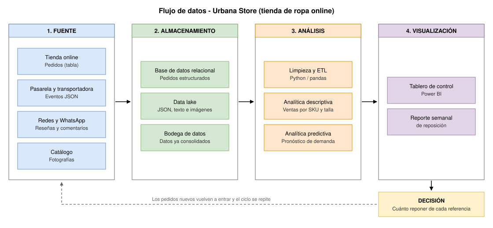

# Parcial Práctico · Corte 1 — Tienda de ropa online

**Programa:** Ingeniería Industrial | **Asignatura:** Ciencia de Datos | **Semana del corte:** 5 | **Periodo:** 2026-B | **Entrega:** Individual, por GitHub (fork del repositorio de la clase) | **Valor:** 2.5 puntos (50 % del parcial) | **Estudiante:** Angelica Vargas Zambrano

---

## El caso que escogí

*Urbana Store* es una microempresa de ropa juvenil con bodega en Neiva que despacha a todo el país. Vende por su página web, por Instagram y por WhatsApp. Maneja unas 350 referencias, cada una con sus tallas y colores, y saca alrededor de 600 pedidos al mes. Los pagos entran por pasarela (tarjeta y PSE) o contra entrega, y los envíos los hace una transportadora nacional.

Escogí este caso por dos razones. La primera es que, siendo un negocio pequeño, ya produce datos de todo tipo: tablas de ventas, archivos que le llegan de la pasarela de pagos, comentarios de clientes y fotos de producto. La segunda es que tiene encima una decisión bien concreta, que es cuánto pedir de cada referencia y de cada talla antes de la temporada. Si el dueño compra de más, la plata se le queda quieta en bodega y termina rematando; si compra de menos, pierde ventas y el cliente se va a otra tienda. Hoy esa decisión la toma a ojo, aunque los datos para sustentarla ya están ahí.

---

## 1. Cuatro tipos de datos y su clasificación

Los datos se clasifican según qué tan organizados vienen desde su origen. Son **estructurados** cuando caben en una tabla de filas y columnas con campos fijos, **semiestructurados** cuando traen algún orden interno pero sin un esquema rígido, y **no estructurados** cuando no tienen ninguna organización que una máquina pueda leer de una vez (Provost & Fawcett, 2013). Estos son los cuatro que identifiqué en la tienda:

| # | Dato | Ejemplo en el caso | Clasificación |
|---|---|---|---|
| 1 | Pedidos | Tabla con `id_pedido`, `fecha`, `id_cliente`, `sku`, `talla`, `cantidad`, `precio`, `descuento`, `ciudad` y `medio_pago` | **Estructurado** |
| 2 | Eventos de la plataforma y de servicios externos | Archivos JSON con la navegación del sitio y las notificaciones de la pasarela de pagos y la transportadora | **Semiestructurado** |
| 3 | Opiniones de clientes | Reseñas de producto, comentarios de Instagram y chats de WhatsApp | **No estructurado** |
| 4 | Fotografías | Fotos del catálogo y las que mandan los clientes cuando piden una devolución | **No estructurado** |

**1. Los pedidos son datos estructurados.** Cada venta se guarda como una fila con un número fijo de columnas, y cada columna tiene un tipo de dato definido de antemano: `cantidad` es un entero, `precio` un decimal, `fecha` una fecha. El esquema se valida al momento de guardar, así que ningún pedido puede llegar con campos de más ni faltando los obligatorios. Esa rigidez es lo que permite consultarlos con SQL sin tener que arreglar nada primero (Kimball & Ross, 2013). Es la fuente más limpia del caso y también la más importante, porque contiene el hecho central del negocio, que es la venta.

**2. Los eventos JSON son datos semiestructurados.** Aquí entra lo que la página registra cuando alguien ve un producto o lo mete al carrito, y también lo que avisan la pasarela de pagos y la transportadora cada vez que cambia el estado de un pedido. Todo llega en formato JSON, donde cada valor viene acompañado de la etiqueta que lo describe, así que hay organización, pero no un esquema fijo (Buneman, 1997). La forma cambia según el evento: la notificación de un pago con tarjeta trae campos de autorización y franquicia que un pago contra entrega simplemente no tiene, y el objeto de un envío incluye una lista de estados que va creciendo mientras el paquete avanza. Por eso no se pueden cargar directo en una tabla, primero hay que aplanarlos y normalizarlos.

**3. Las opiniones de los clientes son datos no estructurados.** Es texto que la gente escribe libremente, sin campos ni longitud definida. Una reseña que dice "la talla M me quedó pequeña, pedí la L y quedó perfecta" tiene información valiosísima sobre el ajuste de esa prenda, pero ningún sistema puede filtrarla ni contarla tal como está. Para poder usarla hay que pasarla antes por técnicas de procesamiento de lenguaje natural, como análisis de sentimiento o extracción de temas, que la conviertan en variables (Provost & Fawcett, 2013).

**4. Las fotografías también son datos no estructurados.** Son archivos de píxeles sin ningún modelo interno que una consulta pueda recorrer. Traen metadatos técnicos como la fecha o el tamaño, pero el contenido en sí, que es el color, el corte o el defecto que se ve en una prenda devuelta, solo se vuelve analizable si alguien lo etiqueta a mano o si se usa un modelo de visión por computador. Las puse aparte de las reseñas porque, aunque caen en la misma categoría, son un tipo de dato distinto y necesitan otro tratamiento.

Con estas cuatro fuentes quedan cubiertos los tres niveles de estructura y alcanza para responder las preguntas del punto siguiente: los pedidos dan el histórico de ventas, los eventos JSON explican qué pasó antes de la compra y cómo terminó el envío, y las reseñas y las fotos dan el contexto que las tablas no alcanzan a mostrar, como la razón real detrás de una devolución.

---

## 2. Pregunta descriptiva y pregunta predictiva

### Analítica descriptiva

> **¿Cuáles fueron las diez referencias más vendidas por ciudad y por talla durante el primer semestre de 2026, y qué porcentaje de los ingresos representó cada una?**

Esta pregunta mira hacia atrás, hacia cosas que ya pasaron y que quedaron registradas. Se responde agrupando y sumando sobre la tabla de pedidos, sin tener que estimar nada. Si dos personas corren la misma consulta sobre los mismos datos, les va a dar exactamente lo mismo, porque la respuesta es un hecho, no un cálculo de probabilidad. Eso es lo que la ubica en el nivel descriptivo del espectro analítico, el del "¿qué pasó?" (Davenport & Harris, 2007). Sirve para decidir dónde concentrar la publicidad y qué referencias hay que sacar de bodega porque están ocupando espacio sin vender.

### Analítica predictiva

> **¿Cuántas unidades del "Jean slim tiro alto" en talla M se van a vender en las próximas cuatro semanas, y qué tan probable es quedarse sin existencias antes de la reposición?**

Esta pregunta se refiere a algo que todavía no ocurre, así que no hay consulta que lo saque de ninguna tabla: hay que estimarlo. Toca entrenar un modelo, de series de tiempo o de regresión, con el histórico de ventas semanales de esa referencia. Como variables de entrada se pueden usar la estacionalidad (temporada escolar, día sin IVA, diciembre), el precio y los descuentos, el tráfico web hacia la ficha del producto (fuente 2) y lo que dicen las reseñas sobre el ajuste de tallas (fuente 3) (Hyndman & Athanasopoulos, 2021). La respuesta que da el modelo no es un dato confirmado sino una estimación, y por eso debería entregarse como un rango o como una probabilidad, nunca como una cifra exacta. Con eso el dueño ya puede decidir cuánto reponer.

### Cómo se conectan las dos

No son preguntas separadas, son dos momentos del mismo trabajo. La descriptiva es la que muestra cuáles referencias concentran los ingresos, y solo vale la pena montar un modelo predictivo para esas, no para las 350. Además, el histórico que resume la descriptiva es justo el que se usa para entrenar el modelo. Cuando un proyecto se salta esa parte y arranca de una vez con lo predictivo, casi siempre termina modelando sobre datos que no entiende (Provost & Fawcett, 2013).

---

## 3. Diagrama del flujo de datos

**Fuente.** Los cuatro tipos de datos del punto 1 se capturan donde nacen: la plataforma web, los servicios de pago y envío, las redes sociales y las fotos del catálogo. Es la única etapa que la tienda no controla del todo, porque depende de sistemas de terceros, y por eso conviene dejar documentado desde el principio cada cuánto llega cada fuente y en qué formato (Kimball & Ross, 2013).

**Almacenamiento.** Los pedidos, que ya vienen tabulados, van a una base de datos relacional. Los JSON, las reseñas y las imágenes se guardan tal cual llegan en un *data lake*. Una vez limpios, todos se consolidan en una bodega de datos. Se separa así porque una base relacional no es el lugar para guardar imágenes ni estructuras anidadas, mientras que el *data lake* recibe cualquier formato en su estado original y deja la definición del esquema para el momento en que se vaya a leer (Kimball & Ross, 2013; Amazon Web Services, s.f.).

**Análisis.** Un proceso en Python normaliza los JSON, corrige tallas mal digitadas y saca los pedidos anulados. Sobre esos datos ya limpios corren la consulta descriptiva y el modelo predictivo del punto 2. La limpieza va antes por una razón práctica: un pedido cancelado que no se excluya infla el pronóstico de demanda y termina haciendo que la tienda compre inventario que no necesita (Provost & Fawcett, 2013).

**Visualización.** Los resultados llegan en un tablero con la evolución de ventas por referencia, talla y ciudad, y en un reporte semanal con las unidades sugeridas de reposición. Esta etapa es la que convierte el análisis en decisión, porque el dueño de la tienda no va a abrir una consulta SQL. Un resultado correcto que nadie entiende termina sirviendo igual que uno que no se hizo (Few, 2012; Davenport & Harris, 2007).

El ciclo se cierra cuando la decisión de reposición genera pedidos nuevos, que vuelven a entrar por la etapa de fuente y alimentan el análisis del siguiente periodo.

---

## 4. Descriptive vs. predictive analytics *(in English)*

Descriptive analytics looks at data the business has already collected, such as past orders and returns, to explain what happened, so the answer it gives is a fact you can check. Predictive analytics takes that same history and uses statistical or machine learning models to estimate something that has not happened yet, such as how many units of one size will sell next month, so the answer it gives is an estimate that always carries some uncertainty.

> *Traducción de apoyo, no cuenta como parte de las dos frases:* la analítica descriptiva revisa datos que el negocio ya recogió, como pedidos y devoluciones, para explicar qué pasó, y su respuesta es un hecho que se puede verificar. La analítica predictiva toma ese mismo histórico y usa modelos estadísticos o de aprendizaje automático para estimar algo que todavía no ha pasado, como cuántas unidades de una talla se van a vender el otro mes, así que su respuesta es una estimación que siempre trae algo de incertidumbre.

---

## Referencias

Amazon Web Services. (s.f.). *What is a data lake?* https://aws.amazon.com/what-is/data-lake/

Buneman, P. (1997). Semistructured data. *Proceedings of the Sixteenth ACM SIGACT-SIGMOD-SIGART Symposium on Principles of Database Systems*, 117–121. https://doi.org/10.1145/263661.263675

Davenport, T. H., & Harris, J. G. (2007). *Competing on analytics: The new science of winning*. Harvard Business School Press.

Few, S. (2012). *Show me the numbers: Designing tables and graphs to enlighten* (2ª ed.). Analytics Press.

Hyndman, R. J., & Athanasopoulos, G. (2021). *Forecasting: Principles and practice* (3ª ed.). OTexts. https://otexts.com/fpp3/

Kimball, R., & Ross, M. (2013). *The data warehouse toolkit: The definitive guide to dimensional modeling* (3ª ed.). Wiley.

Provost, F., & Fawcett, T. (2013). *Data science for business: What you need to know about data mining and data-analytic thinking*. O'Reilly Media.
