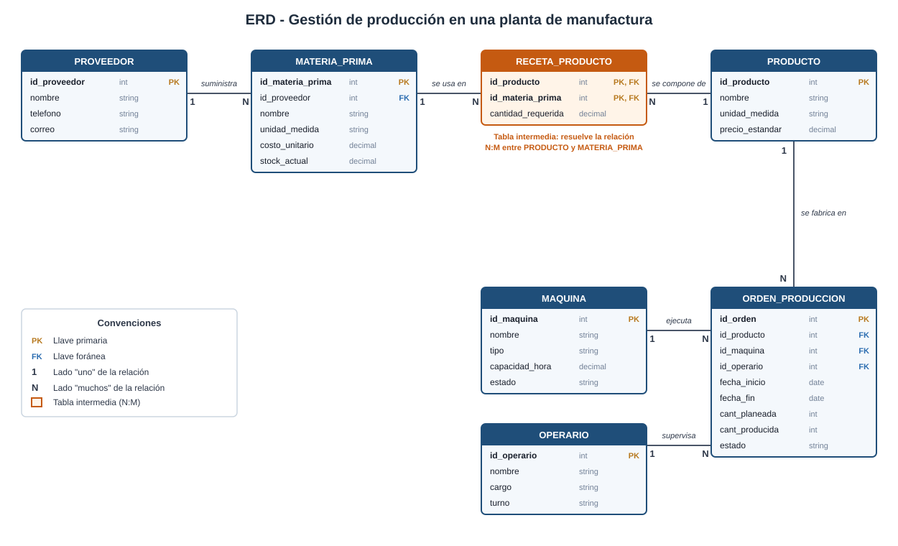
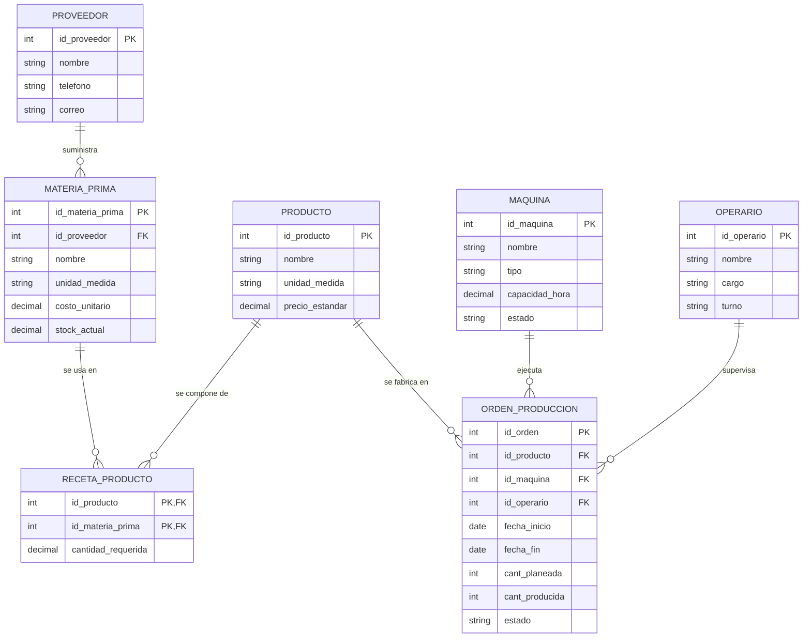

# Ciencia de Datos · Semana 6 · ERD de mi caso

**Caso:** Gestión de producción en una planta de manufactura
**Programa:** Ingeniería Industrial · **Unidad 2:** Modelamiento, transformación y conexión de datos
**Autor:** Angelica Vargas Zambrano · **GitHub:** [avargas-2024a-del](https://github.com/avargas-2024a-del) · **Periodo:** 2026-B

---

## 0. Descripción del caso

Una planta manufacturera fabrica varios productos. Cada producto se elabora a partir de una **receta** que indica qué materias primas y en qué cantidad se necesitan. Las materias primas las suministran **proveedores**. La producción se programa mediante **órdenes de producción**, cada una ejecutada en una **máquina** y supervisada por un **operario**.

**Reglas de negocio que guían el modelo:**

1. Un producto puede requerir muchas materias primas, y una materia prima puede usarse en muchos productos (relación **N:M**).
2. Cada materia prima es suministrada por un proveedor principal; un proveedor puede suministrar muchas materias primas.
3. Cada orden de producción fabrica un solo producto, en una sola máquina y con un operario responsable.
4. Una máquina y un operario pueden atender muchas órdenes a lo largo del tiempo.

---

## 1. Diagrama Entidad-Relación (ERD)

### 1.1 Diagrama



*Versión alternativa del mismo diagrama en Mermaid (GitHub la renderiza automáticamente):*



### 1.2 Entidades, llaves primarias (PK) y foráneas (FK)

| Entidad | PK | FK | Descripción |
|---|---|---|---|
| PROVEEDOR | `id_proveedor` | — | Empresa o persona que suministra materias primas |
| MATERIA_PRIMA | `id_materia_prima` | `id_proveedor` → PROVEEDOR | Insumo que se consume en la producción |
| PRODUCTO | `id_producto` | — | Bien terminado que fabrica la planta |
| **RECETA_PRODUCTO** | (`id_producto`, `id_materia_prima`) — PK compuesta | `id_producto` → PRODUCTO; `id_materia_prima` → MATERIA_PRIMA | **Tabla intermedia** que resuelve la relación N:M |
| MAQUINA | `id_maquina` | — | Equipo donde se ejecuta la producción |
| OPERARIO | `id_operario` | — | Persona responsable de una orden |
| ORDEN_PRODUCCION | `id_orden` | `id_producto`, `id_maquina`, `id_operario` | Solicitud de fabricar una cantidad de un producto |

### 1.3 Relaciones y cardinalidades

| Relación | Cardinalidad | Cómo se implementa |
|---|---|---|
| PROVEEDOR – MATERIA_PRIMA | 1:N | FK `id_proveedor` en MATERIA_PRIMA |
| **PRODUCTO – MATERIA_PRIMA** | **N:M** | **Tabla intermedia RECETA_PRODUCTO** (guarda `cantidad_requerida`) |
| PRODUCTO – ORDEN_PRODUCCION | 1:N | FK `id_producto` en ORDEN_PRODUCCION |
| MAQUINA – ORDEN_PRODUCCION | 1:N | FK `id_maquina` en ORDEN_PRODUCCION |
| OPERARIO – ORDEN_PRODUCCION | 1:N | FK `id_operario` en ORDEN_PRODUCCION |

> **Sobre la relación N:M:** no se puede representar directamente en el modelo relacional, porque habría que guardar listas en una celda. Por eso se crea `RECETA_PRODUCTO`: cada fila une un producto con una materia prima y además almacena un atributo propio de esa unión (`cantidad_requerida`), que no pertenece ni al producto ni a la materia prima por separado.

### 1.4 Diccionario de datos

| Tabla | Campo | Tipo | Restricciones |
|---|---|---|---|
| PROVEEDOR | id_proveedor | INT | PK |
| | nombre | VARCHAR(100) | NOT NULL |
| | telefono | VARCHAR(20) | |
| | correo | VARCHAR(100) | UNIQUE |
| MATERIA_PRIMA | id_materia_prima | INT | PK |
| | id_proveedor | INT | FK, NOT NULL |
| | nombre | VARCHAR(100) | NOT NULL, UNIQUE |
| | unidad_medida | VARCHAR(20) | NOT NULL |
| | costo_unitario | NUMERIC(12,2) | ≥ 0 |
| | stock_actual | NUMERIC(12,2) | ≥ 0 |
| PRODUCTO | id_producto | INT | PK |
| | nombre | VARCHAR(100) | NOT NULL, UNIQUE |
| | unidad_medida | VARCHAR(20) | NOT NULL |
| | precio_estandar | NUMERIC(12,2) | ≥ 0 |
| RECETA_PRODUCTO | id_producto | INT | PK, FK |
| | id_materia_prima | INT | PK, FK |
| | cantidad_requerida | NUMERIC(12,3) | > 0 (por unidad de producto) |
| MAQUINA | id_maquina | INT | PK |
| | nombre | VARCHAR(100) | NOT NULL |
| | tipo | VARCHAR(50) | |
| | capacidad_hora | NUMERIC(10,2) | > 0 |
| | estado | VARCHAR(20) | 'operativa', 'mantenimiento', 'fuera_servicio' |
| OPERARIO | id_operario | INT | PK |
| | nombre | VARCHAR(100) | NOT NULL |
| | cargo | VARCHAR(50) | |
| | turno | VARCHAR(20) | 'diurno', 'nocturno' |
| ORDEN_PRODUCCION | id_orden | INT | PK |
| | id_producto | INT | FK, NOT NULL |
| | id_maquina | INT | FK, NOT NULL |
| | id_operario | INT | FK, NOT NULL |
| | fecha_inicio | DATE | NOT NULL |
| | fecha_fin | DATE | ≥ fecha_inicio |
| | cant_planeada | INT | > 0 |
| | cant_producida | INT | ≥ 0 |
| | estado | VARCHAR(20) | 'programada', 'en_proceso', 'finalizada', 'cancelada' |

---

## 2. Decisión: ¿relacional o NoSQL?

### Decisión: **enfoque relacional (SQL)**

### Justificación

| Criterio | Análisis para este caso | Favorece |
|---|---|---|
| **Estructura de los datos** | Productos, recetas, máquinas y órdenes tienen campos fijos, bien definidos y poco cambiantes. | Relacional |
| **Integridad referencial** | Las FK impiden crear una orden para un producto, máquina u operario que no existe, o borrar un proveedor con materias primas asociadas. | Relacional |
| **Relaciones entre entidades** | El modelo es altamente relacional: hay una N:M y varias 1:N. Consultas como "materia prima necesaria para una orden" requieren unir 4 tablas, algo natural con `JOIN`. | Relacional |
| **Transacciones (ACID)** | Al cerrar una orden se debe registrar lo producido y descontar el stock de materia prima. Ambas operaciones deben ocurrir juntas o no ocurrir. | Relacional |
| **Consultas analíticas** | Indicadores típicos de Ingeniería Industrial (eficiencia por máquina, costo por orden, cumplimiento del plan) se obtienen con agregaciones (`GROUP BY`, `SUM`, `AVG`). | Relacional |
| **Escalabilidad y volumen** | El volumen de una planta (miles de órdenes al año) lo maneja sin problema una base relacional en un solo servidor. | Relacional |
| **Flexibilidad de esquema** | Un esquema rígido dificulta agregar atributos muy variables por producto. | NoSQL (no crítico aquí) |

### Ejemplo de consulta que justifica el modelo relacional

```sql
-- Materia prima total requerida para la orden 1
SELECT mp.nombre,
       op.cant_planeada * rp.cantidad_requerida AS cantidad_total,
       mp.unidad_medida
FROM orden_produccion op
JOIN receta_producto rp ON rp.id_producto = op.id_producto
JOIN materia_prima mp   ON mp.id_materia_prima = rp.id_materia_prima
WHERE op.id_orden = 1;
```

### ¿Dónde sí usaría NoSQL?

En un módulo complementario de **datos de sensores (IoT) de las máquinas** (temperatura, vibración, consumo de energía cada segundo). Ese volumen alto, con formato variable y consulta por rangos de tiempo, encaja mejor en una base de **series de tiempo o documental**. Sería un componente aparte que se conectaría al núcleo relacional mediante `id_maquina`. Es una arquitectura híbrida: **SQL para el núcleo transaccional y NoSQL para los datos masivos de sensores**.

---

## 3. Normalización

### 3.1 Punto de partida: tabla sin normalizar

| id_orden | producto | precio | materias_primas | proveedor | maquina | operario | turno |
|---|---|---|---|---|---|---|---|
| 1 | Silla | 85000 | Madera (2 m), Tornillos (12), Barniz (0.5 L) | Maderas SA, Ferrotor, Pintuco | Cortadora 1 | Ana Ruiz | Diurno |
| 2 | Silla | 85000 | Madera (2 m), Tornillos (12), Barniz (0.5 L) | Maderas SA, Ferrotor, Pintuco | Cortadora 2 | Ana Ruiz | Diurno |

**Problemas detectados:**
- La columna `materias_primas` mezcla varios valores en una sola celda.
- El producto, su precio, la máquina y el operario se **repiten** en cada orden.
- Si cambia el precio de la silla, hay que actualizarlo en muchas filas (riesgo de inconsistencia).

### 3.2 Aplicación paso a paso

**Primera forma normal (1FN): valores atómicos y sin grupos repetidos**
- Se separó la lista de `materias_primas` en filas individuales. Cada par producto-materia prima pasa a ser una fila de `RECETA_PRODUCTO`, con su `cantidad_requerida` como columna aparte.

**Segunda forma normal (2FN): sin dependencias parciales de la clave**
- En `RECETA_PRODUCTO` la clave es (`id_producto`, `id_materia_prima`). Solo `cantidad_requerida` depende de ambas.
- El nombre, la unidad y el costo de la materia prima dependen únicamente de `id_materia_prima`, por eso se movieron a `MATERIA_PRIMA`. Igual ocurre con el nombre y precio del producto, que van en `PRODUCTO`.

**Tercera forma normal (3FN): sin dependencias transitivas**
- En la tabla original, `turno` depende de `operario`, y `operario` depende de la orden (dependencia transitiva). Se separó `OPERARIO`.
- Lo mismo con el `proveedor`, que depende de la materia prima y no de la orden: se creó `PROVEEDOR`, referenciado desde `MATERIA_PRIMA`.
- `ORDEN_PRODUCCION` conserva solo sus datos propios (fechas, cantidades, estado) y las **FK** hacia las demás tablas.

### 3.3 Resumen: qué se evitó repetir

| Dato | Antes | Ahora | Beneficio |
|---|---|---|---|
| Nombre y precio del producto | En cada orden | Solo en `PRODUCTO` | Un cambio de precio se hace en una fila |
| Datos de la máquina | En cada orden | Solo en `MAQUINA` | Se actualiza el estado en un solo lugar |
| Nombre y turno del operario | En cada orden | Solo en `OPERARIO` | Sin inconsistencias de turno |
| Costo y unidad de materia prima | En cada receta y orden | Solo en `MATERIA_PRIMA` | Un costo, una fuente de verdad |
| Datos del proveedor | En cada materia prima | Solo en `PROVEEDOR` | Contacto actualizado en un solo lugar |

**Anomalías que se evitan:**
- **Inserción:** se puede registrar un producto o una máquina nueva sin necesidad de que tengan una orden.
- **Actualización:** cambiar un dato se hace una sola vez.
- **Eliminación:** borrar una orden no elimina la información del producto, la máquina o el operario.

---

## 4. Script SQL (PostgreSQL)

```sql
CREATE TABLE proveedor (
    id_proveedor SERIAL PRIMARY KEY,
    nombre       VARCHAR(100) NOT NULL,
    telefono     VARCHAR(20),
    correo       VARCHAR(100) UNIQUE
);

CREATE TABLE materia_prima (
    id_materia_prima SERIAL PRIMARY KEY,
    id_proveedor     INT NOT NULL REFERENCES proveedor(id_proveedor),
    nombre           VARCHAR(100) NOT NULL UNIQUE,
    unidad_medida    VARCHAR(20)  NOT NULL,
    costo_unitario   NUMERIC(12,2) CHECK (costo_unitario >= 0),
    stock_actual     NUMERIC(12,2) DEFAULT 0 CHECK (stock_actual >= 0)
);

CREATE TABLE producto (
    id_producto     SERIAL PRIMARY KEY,
    nombre          VARCHAR(100) NOT NULL UNIQUE,
    unidad_medida   VARCHAR(20)  NOT NULL,
    precio_estandar NUMERIC(12,2) CHECK (precio_estandar >= 0)
);

-- Tabla intermedia de la relación N:M
CREATE TABLE receta_producto (
    id_producto        INT NOT NULL REFERENCES producto(id_producto),
    id_materia_prima   INT NOT NULL REFERENCES materia_prima(id_materia_prima),
    cantidad_requerida NUMERIC(12,3) NOT NULL CHECK (cantidad_requerida > 0),
    PRIMARY KEY (id_producto, id_materia_prima)
);

CREATE TABLE maquina (
    id_maquina     SERIAL PRIMARY KEY,
    nombre         VARCHAR(100) NOT NULL,
    tipo           VARCHAR(50),
    capacidad_hora NUMERIC(10,2) CHECK (capacidad_hora > 0),
    estado         VARCHAR(20) DEFAULT 'operativa'
        CHECK (estado IN ('operativa','mantenimiento','fuera_servicio'))
);

CREATE TABLE operario (
    id_operario SERIAL PRIMARY KEY,
    nombre      VARCHAR(100) NOT NULL,
    cargo       VARCHAR(50),
    turno       VARCHAR(20) CHECK (turno IN ('diurno','nocturno'))
);

CREATE TABLE orden_produccion (
    id_orden       SERIAL PRIMARY KEY,
    id_producto    INT NOT NULL REFERENCES producto(id_producto),
    id_maquina     INT NOT NULL REFERENCES maquina(id_maquina),
    id_operario    INT NOT NULL REFERENCES operario(id_operario),
    fecha_inicio   DATE NOT NULL,
    fecha_fin      DATE,
    cant_planeada  INT NOT NULL CHECK (cant_planeada > 0),
    cant_producida INT DEFAULT 0 CHECK (cant_producida >= 0),
    estado         VARCHAR(20) DEFAULT 'programada'
        CHECK (estado IN ('programada','en_proceso','finalizada','cancelada')),
    CHECK (fecha_fin IS NULL OR fecha_fin >= fecha_inicio)
);
```

---

## 5. Conclusiones

- El modelo tiene **7 entidades** (6 de negocio y 1 tabla intermedia), con PK y FK definidas y una relación **N:M** resuelta mediante `RECETA_PRODUCTO`.
- Se eligió el enfoque **relacional** por la estructura fija de los datos, la necesidad de integridad referencial y de transacciones, y el tipo de consultas analíticas de la operación. NoSQL queda como complemento para datos de sensores.
- El diseño llega a **3FN**, eliminando redundancia y evitando anomalías de inserción, actualización y eliminación.

---

## 6. Referencias

- Chen, P. P. (1976). The entity-relationship model: Toward a unified view of data. *ACM Transactions on Database Systems, 1*(1), 9-36.
- Codd, E. F. (1970). A relational model of data for large shared data banks. *Communications of the ACM, 13*(6), 377-387.
- Date, C. J. (2019). *Database design and relational theory: Normal forms and all that jazz* (2.ª ed.). Apress.
- Elmasri, R., & Navathe, S. B. (2016). *Fundamentals of database systems* (7.ª ed.). Pearson.
- Kent, W. (1983). A simple guide to five normal forms in relational database theory. *Communications of the ACM, 26*(2), 120-125.
- Sadalage, P. J., & Fowler, M. (2012). *NoSQL distilled: A brief guide to the emerging world of polyglot persistence*. Addison-Wesley.
- Silberschatz, A., Korth, H. F., & Sudarshan, S. (2019). *Database system concepts* (7.ª ed.). McGraw-Hill.
- Mermaid. (s. f.). *Entity relationship diagrams*. https://mermaid.js.org/syntax/entityRelationshipDiagram.html
- The PostgreSQL Global Development Group. (s. f.). *PostgreSQL documentation*. https://www.postgresql.org/docs/
