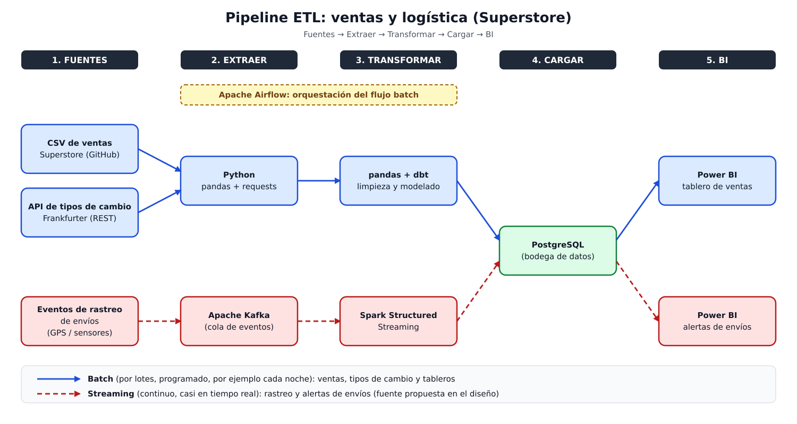
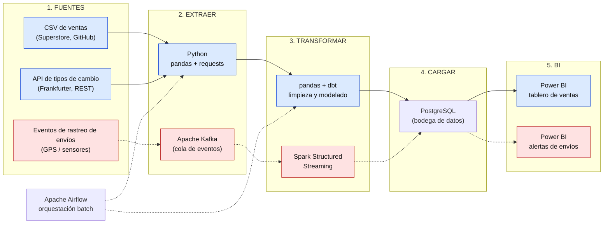

# Ciencia de Datos · Semana 8 · Diseña un pipeline ETL

**Caso:** Ventas y logística de una empresa de suministros de oficina
**Programa:** Ingeniería Industrial · **Unidad 2:** Modelamiento, transformación y conexión de datos
**Autor:** Angelica Vargas Zambrano · **GitHub:** [avargas-2024a-del](https://github.com/avargas-2024a-del) · **Periodo:** 2026-B
**Herramientas:** Mermaid (diagrama), Python 3, pandas, requests, SQLite

---

## Tabla de contenido

1. [Descripción del proyecto](#1-descripción-del-proyecto)
2. [Caso y fuentes de datos](#2-caso-y-fuentes-de-datos)
3. [Diagrama del pipeline ETL](#3-diagrama-del-pipeline-etl)
4. [Detalle de cada etapa y herramienta](#4-detalle-de-cada-etapa-y-herramienta)
5. [Batch vs. streaming (justificación)](#5-batch-vs-streaming-justificación)
6. [Consumo de una API pública con requests (opcional)](#6-consumo-de-una-api-pública-con-requests-opcional)
7. [Extra: mini pipeline ETL ejecutable](#7-extra-mini-pipeline-etl-ejecutable)
8. [Conclusiones](#8-conclusiones)
9. [Referencias](#9-referencias)

---

## 1. Descripción del proyecto

Esta guía de la Semana 8 pide diseñar un **flujo ETL de extremo a extremo** (*Extract, Transform, Load*) y consumir datos de una API. Para cumplirla se hizo lo siguiente:

- **Diagrama del pipeline** para el caso: fuentes → extraer → transformar → cargar → BI, indicando la **herramienta de cada paso**.
- **Justificación de qué partes son batch y cuáles streaming**, y por qué.
- **(Opcional) Consumo de una API pública** con `requests`, mostrando 3 registros.
- **(Extra) Un mini pipeline ETL ejecutable** en Python que extrae el dataset, lo limpia, lo carga en una base de datos y lo consulta como lo haría un tablero de BI.

| Requisito de la guía | Dónde se cumple |
|---|---|
| Diagrama del pipeline con herramientas por etapa | Secciones 3 y 4 (imagen `pipeline_etl.svg` en esta misma carpeta) |
| Justificación batch/streaming | Sección 5 |
| API pública con `requests` y 3 registros (opcional) | Sección 6 |
| Extra: pipeline ejecutable | Sección 7 |

> **Aclaración importante:** el diseño de la sección 3 es una **propuesta de arquitectura** para el caso. Lo que realmente se programó y se ejecutó es lo de las secciones 6 y 7. Las herramientas de la parte de streaming (por ejemplo Kafka y Spark) se proponen en el diseño, pero no se instalaron ni se ejecutaron en este trabajo.

---

## 2. Caso y fuentes de datos

El caso continúa el de los trabajos anteriores: una empresa que vende suministros de oficina, tecnología y mobiliario, y que necesita **analizar sus ventas, su utilidad y sus tiempos de envío**. El dataset que se usa es **Superstore Sales** (8,399 líneas de pedido y 21 columnas), disponible en <https://raw.githubusercontent.com/curran/data/gh-pages/superstoreSales/superstoreSales.csv>.

Para el pipeline se identifican **tres fuentes de datos**:

| # | Fuente | Tipo de dato | Estado en este trabajo |
|---|---|---|---|
| 1 | Archivo CSV de ventas (Superstore) | Histórico de pedidos: ventas, utilidad, descuentos, envíos | **Real:** es el dataset del curso, se usa en la sección 7. |
| 2 | API de tipos de cambio (Frankfurter) | Tasas de cambio publicadas diariamente | **Real:** se consume en la sección 6. |
| 3 | Eventos de rastreo de envíos (GPS / sensores de transporte) | Mensajes continuos con la ubicación y el estado de cada envío | **Propuesta de diseño:** no existe en el dataset; se incluye para justificar el uso de streaming. |

---

## 3. Diagrama del pipeline ETL

En el diagrama, las **flechas continuas y los nodos azules** son el flujo **batch**; las **flechas punteadas y los nodos rojos** son el flujo **streaming**. Apache Airflow orquesta (programa y vigila) las tareas batch.



*Versión alternativa del mismo diagrama en Mermaid (GitHub la renderiza automáticamente):*



**Resumen de herramientas por etapa:**

| Etapa | Flujo batch | Flujo streaming |
|---|---|---|
| 1. Fuentes | CSV de ventas, API de tipos de cambio | Eventos de rastreo de envíos |
| 2. Extraer | Python (pandas, requests) | Apache Kafka |
| 3. Transformar | pandas + dbt | Spark Structured Streaming |
| 4. Cargar | PostgreSQL | PostgreSQL |
| 5. BI | Power BI (tablero de ventas) | Power BI (alertas de envíos) |
| Orquestación | Apache Airflow | — |

---

## 4. Detalle de cada etapa y herramienta

| Etapa | Qué se hace | Herramienta | Por qué esta herramienta |
|---|---|---|---|
| **1. Fuentes** | Se identifican los datos de entrada: archivo CSV de ventas, API de tipos de cambio y eventos de envíos. | CSV, API REST, GPS/sensores | Son las fuentes que necesita el caso para analizar ventas, costos y entregas. |
| **2. Extraer (batch)** | Se descarga el CSV (con la codificación `mac_roman`) y se consulta la API de tasas de cambio. | Python con `pandas` y `requests` | Son librerías gratuitas, sencillas y suficientes para leer archivos y consumir APIs. |
| **2. Extraer (streaming)** | Se reciben los mensajes de rastreo a medida que se generan y se guardan en una cola. | Apache Kafka | Permite recibir muchos mensajes por segundo sin perderlos, aunque el siguiente paso se retrase. |
| **3. Transformar (batch)** | Limpieza vista en el Corte 2: nombres de columnas en `snake_case`, eliminar duplicados, corregir ortografía (`Prarie` → `Prairie`), imputar nulos del margen base, convertir fechas y calcular `dias_envio`. Luego se organiza en tablas (modelo ERD). | `pandas` para la limpieza y `dbt` para las transformaciones en SQL | `pandas` limpia los datos crudos; `dbt` deja las transformaciones SQL versionadas y documentadas. |
| **3. Transformar (streaming)** | Se filtran y agrupan los eventos en ventanas de tiempo (por ejemplo, envíos críticos sin movimiento en los últimos minutos). | Spark Structured Streaming | Procesa flujos continuos con la misma lógica que un procesamiento por lotes. |
| **4. Cargar** | Se guardan las tablas limpias en la bodega de datos, con claves primarias y foráneas. | PostgreSQL | Base de datos relacional gratuita, que soporta el modelo ERD y consultas SQL (Semana 7). |
| **5. BI** | Se conecta el tablero a la bodega: ventas y utilidad por segmento, región y año; tiempos y costos de envío; alertas de envíos. | Power BI | Permite crear tableros interactivos sin programar y conectarse a PostgreSQL. |
| **Orquestación** | Se programa que el flujo batch corra cada noche, en orden (extraer → transformar → cargar), con reintentos si algo falla. | Apache Airflow | Programa, ordena y vigila las tareas, y avisa cuando una falla. |

---

## 5. Batch vs. streaming (justificación)

**Batch** significa procesar los datos **por lotes**, en momentos programados (por ejemplo, una vez al día). **Streaming** significa procesarlos **de forma continua**, a medida que llegan. La elección depende de **qué tan rápido se necesita la información**.

| Componente del pipeline | Tipo | Frecuencia propuesta | Justificación |
|---|---|---|---|
| Carga del histórico de ventas (CSV / sistema de pedidos) | **Batch** | Una vez al día (por ejemplo, de noche) | Los informes de ventas y utilidad se revisan por día, mes o año. No hace falta verlos al segundo, y procesar por lotes es más barato y simple. |
| Tipos de cambio (API Frankfurter) | **Batch** | Una vez al día | La propia documentación de la API indica que las tasas se actualizan una vez al día (alrededor de las 16:00 hora de Europa central), por lo que consultar con más frecuencia no traería datos nuevos. |
| Limpieza y modelado (pandas + dbt) | **Batch** | Después de cada carga | Limpiar duplicados, nulos y tipos es más eficiente sobre un conjunto completo de datos. |
| Tableros de ventas y utilidad (Power BI) | **Batch** | Se refresca después de cada carga | Las decisiones comerciales (por segmento, región o categoría) no cambian de un minuto a otro. |
| Rastreo de envíos (GPS / sensores) | **Streaming** | Continuo | Un envío de prioridad crítica retrasado se debe detectar **mientras ocurre**, para poder actuar. Si se detectara al día siguiente, ya sería tarde. |
| Alertas de envíos (Power BI) | **Streaming** | Casi en tiempo real | Su utilidad depende de la rapidez: avisar de un retraso al día siguiente no sirve. |

**Conclusión de la justificación:** el pipeline es **mixto (híbrido)**. La mayor parte es **batch** porque los datos de ventas, los costos y las tasas de cambio se analizan de forma periódica y no pierden valor por esperar unas horas. El **streaming** se reserva para el rastreo de envíos, donde el tiempo de reacción sí importa. Usar streaming para todo sería más costoso y complejo sin aportar beneficio, y usar solo batch dejaría sin respuesta oportuna a los retrasos de entrega.

---

## 6. Consumo de una API pública con requests (opcional)

Se consume la **API pública de Frankfurter**, que entrega tasas de cambio publicadas por el Banco Central Europeo. No requiere clave ni registro. Esta API representa la **fuente 2** del pipeline (extracción batch con `requests`). El endpoint `latest` devuelve las tasas más recientes con el euro (EUR) como moneda base; se muestran 3 monedas relevantes para el caso: el dólar canadiense (CAD, porque las ventas del dataset son de Canadá), el dólar estadounidense (USD) y el peso mexicano (MXN).

```python
import requests

URL_API = "https://api.frankfurter.dev/v1/latest"

respuesta = requests.get(URL_API, timeout=30)
respuesta.raise_for_status()          # lanza un error si la API responde con falla
datos = respuesta.json()

print("Código de estado:", respuesta.status_code)
print("Moneda base:", datos["base"], "| Fecha de las tasas:", datos["date"])
print("Monedas disponibles:", len(datos["rates"]))

print("\nTres registros:")
for moneda in ["CAD", "USD", "MXN"]:
    print(f"1 {datos['base']} = {datos['rates'][moneda]} {moneda}")

# Pequeña transformación: tasa de 1 USD expresada en CAD
usd_a_cad = datos["rates"]["CAD"] / datos["rates"]["USD"]
print(f"\n1 USD = {usd_a_cad:.4f} CAD")
```

**Resultado** (respuesta obtenida el 1 de octubre de 2026):

```text
Código de estado: 200
Moneda base: EUR | Fecha de las tasas: 2026-10-01
Monedas disponibles: 29

Tres registros:
1 EUR = 1.6095 CAD
1 EUR = 1.1298 USD
1 EUR = 20.5251 MXN

1 USD = 1.4246 CAD
```

| Registro | Moneda | Tasa (1 EUR =) |
|---:|---|---:|
| 1 | CAD (dólar canadiense) | 1.6095 |
| 2 | USD (dólar estadounidense) | 1.1298 |
| 3 | MXN (peso mexicano) | 20.5251 |

**Explicación:** `requests.get()` envía la solicitud a la API y `.json()` convierte la respuesta en un diccionario de Python, del que se leen la fecha, la moneda base y las tasas. Los valores **cambian cada día hábil**, por lo que al volver a ejecutar el código se obtendrán fechas y tasas distintas. En un pipeline real, este paso correría una vez al día con Airflow y las tasas se guardarían en una tabla de la bodega de datos, para poder expresar las ventas en otra moneda si fuera necesario.

---

## 7. Extra: mini pipeline ETL ejecutable

Para mostrar el ciclo **Extract → Transform → Load → BI** funcionando, se programó una versión pequeña del pipeline con el dataset de ventas: se **extrae** el CSV, se **transforma** (limpieza del Corte 2), se **carga** en una base de datos SQLite y se hace una **consulta de BI** (el tipo de resumen que mostraría un tablero).

```python
import sqlite3
import pandas as pd

URL = ("https://raw.githubusercontent.com/curran/data/gh-pages/"
       "superstoreSales/superstoreSales.csv")

# ---------- E: EXTRAER ----------
crudo = pd.read_csv(URL, encoding="mac_roman")
print("Extraídas:", len(crudo), "filas")

# ---------- T: TRANSFORMAR ----------
datos = crudo.copy()
datos.columns = (datos.columns.str.strip().str.lower()
                              .str.replace(r"[\s\-]+", "_", regex=True))
datos = datos.drop_duplicates(subset=[c for c in datos.columns if c != "row_id"])
datos["region"] = datos["region"].replace({"Prarie": "Prairie"})
datos["province"] = datos["province"].replace({"Saskachewan": "Saskatchewan"})
mediana = datos.groupby("product_sub_category")["product_base_margin"].transform("median")
datos["product_base_margin"] = datos["product_base_margin"].fillna(mediana)
datos["order_date"] = pd.to_datetime(datos["order_date"], format="%m/%d/%Y")
datos["ship_date"] = pd.to_datetime(datos["ship_date"], format="%m/%d/%Y")
datos["dias_envio"] = (datos["ship_date"] - datos["order_date"]).dt.days
datos["anio"] = datos["order_date"].dt.year
print("Transformadas:", len(datos), "filas | nulos:", int(datos.isnull().sum().sum()))

# ---------- L: CARGAR ----------
con = sqlite3.connect(":memory:")
datos.to_sql("ventas_limpias", con, index=False)
print("Cargadas en SQLite:", con.execute("SELECT COUNT(*) FROM ventas_limpias").fetchone()[0], "filas")

# ---------- BI: consulta para el tablero ----------
consulta_bi = """
SELECT anio,
       COUNT(*)                                      AS lineas,
       ROUND(SUM(sales), 2)                          AS ventas,
       ROUND(SUM(profit), 2)                         AS utilidad,
       ROUND(100.0 * SUM(profit) / SUM(sales), 2)    AS margen_pct,
       ROUND(AVG(dias_envio), 2)                     AS dias_envio_prom
FROM ventas_limpias
GROUP BY anio
ORDER BY anio;
"""
print(pd.read_sql_query(consulta_bi, con).to_string(index=False))
```

**Resultado:**

```text
Extraídas: 8399 filas
Transformadas: 8399 filas | nulos: 0
Cargadas en SQLite: 8399 filas
```

| anio | lineas | ventas | utilidad | margen_pct | dias_envio_prom |
|---:|---:|---:|---:|---:|---:|
| 2009 | 2,153 | 4,209,139.46 | 434,538.73 | 10.32 | 1.92 |
| 2010 | 2,142 | 3,549,680.80 | 363,871.48 | 10.25 | 2.23 |
| 2011 | 2,002 | 3,436,816.70 | 381,455.99 | 11.10 | 1.95 |
| 2012 | 2,102 | 3,719,963.86 | 341,901.78 | 9.19 | 2.02 |

**Explicación:** las 8,399 filas extraídas llegan completas hasta la carga, y después de transformar no quedan valores nulos (antes había 63 en el margen base). La consulta final es el tipo de resumen que alimentaría un tablero de BI: por cada año muestra las líneas de pedido, las ventas, la utilidad, el margen y los días promedio de envío. En estos datos, 2012 tuvo el margen más bajo (9.19 %) y 2011 el más alto (11.10 %). Este ejemplo usa SQLite en memoria para que se pueda ejecutar sin instalar nada; en el diseño de la sección 3 esa carga se haría en PostgreSQL.

---

## 8. Conclusiones

- Se diseñó un **pipeline ETL completo** para el caso (fuentes → extraer → transformar → cargar → BI), con una herramienta indicada en cada etapa y un diagrama que distingue el flujo batch del streaming.
- El pipeline es **híbrido**: la mayor parte es batch (ventas, tasas de cambio, tableros) y el streaming se reserva para el rastreo de envíos, donde la rapidez de reacción tiene valor.
- Se **consumió una API pública** con `requests` y se mostraron 3 registros reales (tasas de cambio del 1 de octubre de 2026).
- Se programó un **mini pipeline ETL ejecutable** que lleva las 8,399 filas del dataset desde la extracción hasta una consulta de BI, sin valores nulos al final.
- Limitación: la parte de streaming (Kafka y Spark) y las herramientas de la bodega y del tablero (PostgreSQL, dbt, Airflow y Power BI) son una **propuesta de diseño** y no se implementaron aquí; lo ejecutado se limita a Python, pandas, requests y SQLite.

---

## 9. Referencias

- Frankfurter. (s. f.). *Frankfurter: free and open-source API for current and historical foreign exchange rates*. <https://frankfurter.dev>
- Curran, M. (s. f.). *superstoreSales.csv* [Conjunto de datos]. Repositorio `curran/data`, GitHub. <https://raw.githubusercontent.com/curran/data/gh-pages/superstoreSales/superstoreSales.csv>
- Reitz, K. (s. f.). *Requests: HTTP for Humans — documentation*. <https://requests.readthedocs.io/>
- The pandas development team. (s. f.). *pandas documentation*. <https://pandas.pydata.org/docs/>
- Python Software Foundation. (s. f.). *sqlite3 — DB-API 2.0 interface for SQLite databases*. <https://docs.python.org/3/library/sqlite3.html>
- The Apache Software Foundation. (s. f.). *Apache Airflow documentation*. <https://airflow.apache.org/docs/>
- The Apache Software Foundation. (s. f.). *Apache Kafka documentation*. <https://kafka.apache.org/documentation/>
- The Apache Software Foundation. (s. f.). *Apache Spark — Structured Streaming Programming Guide*. <https://spark.apache.org/docs/latest/structured-streaming-programming-guide.html>
- dbt Labs. (s. f.). *dbt documentation*. <https://docs.getdbt.com/>
- PostgreSQL Global Development Group. (s. f.). *PostgreSQL documentation*. <https://www.postgresql.org/docs/>
- Microsoft. (s. f.). *Power BI documentation*. <https://learn.microsoft.com/en-us/power-bi/>
- Mermaid. (s. f.). *Flowchart syntax*. <https://mermaid.js.org/syntax/flowchart.html>
- Corporación Universitaria del Huila – CORHUILA. (2026). *Guía de actividad práctica: Ciencia de Datos, Semana 8 · Diseña un pipeline ETL*. Material de la asignatura.
