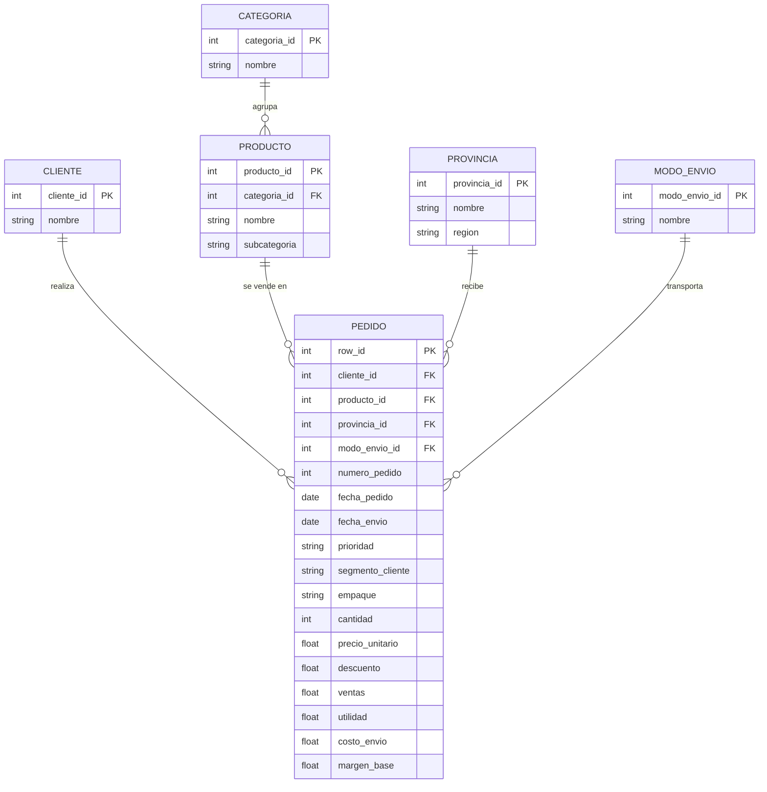

# Actividad Calificable — Corte 2
## Modelo, consulta y limpieza de datos

**Programa:** Ingeniería Mecatronica
**Autor:** Angelica Vargas Zambrano · **GitHub:** [avargas-2024a-del](https://github.com/avargas-2024a-del) · **Periodo:** 2026-B
**Herramientas:** Python 3, pandas, Mermaid

---

## Tabla de contenido

1. [Descripción del proyecto](#1-descripción-del-proyecto)
2. [Dataset](#2-dataset)
3. [Modelo ERD](#3-modelo-erd)
4. [Carga y limpieza de datos (antes y después)](#4-carga-y-limpieza-de-datos-antes-y-después)
5. [Consultas y hallazgos](#5-consultas-y-hallazgos)
6. [Data & cleaning](#data--cleaning)
7. [Conclusiones](#7-conclusiones)
8. [Cómo ejecutar el código](#8-cómo-ejecutar-el-código)
9. [Referencias](#9-referencias)

---

### 1. Descripción del proyecto

En este trabajo se desarrollaron los tres puntos de la actividad calificable del Corte 2:

- **Diseño de un modelo entidad-relación (ERD)** con seis entidades, sus atributos, claves y cardinalidades, representado con Mermaid.
- **Carga y limpieza de un dataset real** con Python y pandas: conteo de nulos, imputación, eliminación de duplicados, corrección de tipos y normalización de formatos, mostrando el estado **antes y después**.
- **Respuesta a dos preguntas** mediante consultas con pandas que combinan **filtro + agregación**, con su código, su resultado y la explicación del hallazgo.

El dataset utilizado es **Superstore Sales**, un registro de 8,399 líneas de pedidos de una empresa que vende suministros de oficina, tecnología y mobiliario en Canadá. Se eligió porque está relacionado con la ingeniería industrial (ventas, logística de envíos, costos y utilidad), es público, se carga con pandas y presenta problemas reales de calidad de datos: una codificación de texto que no es UTF-8, valores nulos, fechas guardadas como texto y errores de ortografía en nombres de regiones. El análisis busca practicar el ciclo básico de trabajo con datos: **modelar, limpiar y consultar**.

---

### 2. Dataset

| Característica | Detalle |
|---|---|
| **Nombre** | Superstore Sales (`superstoreSales.csv`) |
| **Fuente** | Repositorio público `curran/data` en GitHub, carpeta `superstoreSales` |
| **Enlace directo al CSV** | <https://raw.githubusercontent.com/curran/data/gh-pages/superstoreSales/superstoreSales.csv> |
| **Número de registros** | 8,399 (cada registro es una línea de pedido) |
| **Número de columnas** | 21 (originales) |
| **Periodo cubierto** | Fechas de pedido entre el 1 de enero de 2009 y el 30 de diciembre de 2012 |
| **Tipo de información** | Ventas y logística: pedidos, prioridad, modo de envío, costos, utilidad, clientes, ubicación (provincia y región), producto y categoría |

**Columnas principales del dataset original:**

| Columna | Tipo de dato (original) | Descripción |
|---|---|---|
| `Row ID` | int64 | Identificador único de cada línea de pedido. |
| `Order ID` | int64 | Número del pedido (un mismo pedido puede tener varias líneas). |
| `Order Date` | texto | Fecha del pedido (formato mes/día/año). |
| `Order Priority` | texto | Prioridad: Critical, High, Medium, Low o Not Specified. |
| `Order Quantity` | int64 | Cantidad de unidades pedidas. |
| `Sales` | float64 | Valor de la venta. |
| `Discount` | float64 | Descuento aplicado (fracción, por ejemplo 0.05). |
| `Ship Mode` | texto | Modo de envío: Regular Air, Express Air o Delivery Truck. |
| `Profit` | float64 | Utilidad de la línea (puede ser negativa). |
| `Unit Price` | float64 | Precio unitario. |
| `Shipping Cost` | float64 | Costo del envío. |
| `Customer Name` | texto | Nombre del cliente. |
| `Province` | texto | Provincia o territorio de destino. |
| `Region` | texto | Región de ventas. |
| `Customer Segment` | texto | Segmento: Consumer, Corporate, Home Office o Small Business. |
| `Product Category` | texto | Categoría: Office Supplies, Technology o Furniture. |
| `Product Sub-Category` | texto | Subcategoría del producto (17 en total). |
| `Product Name` | texto | Nombre del producto. |
| `Product Container` | texto | Tipo de empaque (Small Box, Large Box, Jumbo Drum, etc.). |
| `Product Base Margin` | float64 | Margen base del producto (fracción entre 0 y 1). |
| `Ship Date` | texto | Fecha de envío (formato mes/día/año). |

---

### 3. Modelo ERD

A partir de las columnas del dataset se diseñó un modelo normalizado de **6 entidades**: `CLIENTE`, `PRODUCTO`, `CATEGORIA`, `PEDIDO`, `PROVINCIA` y `MODO_ENVIO`. La idea es separar la información que se repite (nombre del cliente, categoría, provincia, modo de envío) en tablas propias para evitar redundancia.



**Claves y cardinalidades:**

| Relación | Cardinalidad | Explicación |
|---|---|---|
| `CLIENTE` — `PEDIDO` | 1 a N (uno a muchos) | Un cliente realiza muchas líneas de pedido; cada línea pertenece a un solo cliente. |
| `PRODUCTO` — `PEDIDO` | 1 a N (uno a muchos) | Un producto aparece en muchas líneas de pedido; cada línea corresponde a un solo producto. |
| `CATEGORIA` — `PRODUCTO` | 1 a N (uno a muchos) | Una categoría agrupa muchos productos; cada producto pertenece a una sola categoría. |
| `PROVINCIA` — `PEDIDO` | 1 a N (uno a muchos) | A una provincia llegan muchas líneas de pedido; cada línea tiene una sola provincia de destino. |
| `MODO_ENVIO` — `PEDIDO` | 1 a N (uno a muchos) | Un modo de envío transporta muchas líneas de pedido; cada línea usa un solo modo. |

**Claves primarias (PK):** `cliente_id`, `categoria_id`, `producto_id`, `provincia_id`, `modo_envio_id` y `row_id`.
**Claves foráneas (FK):** `PRODUCTO.categoria_id`, `PEDIDO.cliente_id`, `PEDIDO.producto_id`, `PEDIDO.provincia_id` y `PEDIDO.modo_envio_id`.

> Notas sobre el diseño: (1) `PEDIDO` representa una **línea de pedido** (`row_id`), porque el campo `Order ID` se repite: hay 5,496 números de pedido distintos en 8,399 líneas. (2) Los atributos `segmento_cliente`, `empaque` y `margen_base` se dejaron en `PEDIDO` porque en el dataset un mismo cliente o producto aparece con más de un valor de esos campos. (3) El CSV original viene "aplanado" en una sola tabla; en el código se trabaja con esa tabla única.

---

### 4. Carga y limpieza de datos (antes y después)

#### 4.1 Carga del dataset y estado inicial

El archivo **no está codificado en UTF-8** (al intentar leerlo así, pandas lanza un `UnicodeDecodeError`). Se leyó con la codificación `mac_roman`, con la que los símbolos de los nombres de producto (por ejemplo ® y ™) se leen correctamente.

```python
import pandas as pd

URL = ("https://raw.githubusercontent.com/curran/data/gh-pages/"
       "superstoreSales/superstoreSales.csv")

df = pd.read_csv(URL, encoding="mac_roman")
df_original = df.copy()          # copia para poder comparar antes/después

print("Dimensiones (filas, columnas):", df.shape)
print("\nTipos de datos ANTES:")
print(df.dtypes)
print("\nValores nulos por columna ANTES:")
print(df.isnull().sum())
print("\nTotal de nulos ANTES:", df.isnull().sum().sum())
print("\nPrimeras filas:")
print(df.head())
```

**Resultado (resumen):**

- Dimensiones: **8,399 filas × 21 columnas**.
- Valores nulos: solo la columna `Product Base Margin` tiene nulos.

| Columna | Nulos ANTES | % del total |
|---|---:|---:|
| `Product Base Margin` | 63 | 0.75 % |
| Las demás columnas | 0 | 0 % |
| **Total de nulos** | **63** | — |

#### 4.2 Detección de duplicados

```python
cols_sin_id = [c for c in df.columns if c != "Row ID"]

print("Filas completamente duplicadas:", df.duplicated().sum())
print("Duplicadas ignorando Row ID:", df.duplicated(subset=cols_sin_id).sum())
print("Pedidos distintos (Order ID):", df["Order ID"].nunique(), "de", len(df), "líneas")
```

**Resultado:** 0 filas duplicadas, tanto en filas completas como ignorando `Row ID`. El dataset **no contiene registros duplicados**; aun así se aplica la eliminación como paso de control (no elimina ninguna fila). Que `Order ID` se repita (5,496 pedidos distintos en 8,399 líneas) **no es un error**: un pedido puede tener varias líneas de producto.

#### 4.3 Proceso de limpieza

```python
# 1) Normalizar nombres de columnas: minúsculas y guion bajo (snake_case)
df.columns = (df.columns.str.strip().str.lower()
                         .str.replace(r"[\s\-]+", "_", regex=True))

# 2) Normalizar texto: quitar espacios al inicio/final y espacios dobles
columnas_texto = df.select_dtypes(include=["object", "string"]).columns
for col in columnas_texto:
    df[col] = (df[col].astype("string")
                      .str.strip()
                      .str.replace(r"\s+", " ", regex=True))

# 3) Eliminar duplicados (ignorando el identificador de la línea)
df = df.drop_duplicates(subset=[c for c in df.columns if c != "row_id"])

# 4) Corregir errores de ortografía en nombres de región y provincia
df["region"] = df["region"].replace({"Prarie": "Prairie"})
df["province"] = df["province"].replace({"Saskachewan": "Saskatchewan"})

# 5) Nulos en product_base_margin (63): imputar con la mediana de su subcategoría
mediana_sub = df.groupby("product_sub_category")["product_base_margin"].transform("median")
df["product_base_margin"] = df["product_base_margin"].fillna(mediana_sub)

# 6) Corregir tipos: fechas a datetime
df["order_date"] = pd.to_datetime(df["order_date"], format="%m/%d/%Y")
df["ship_date"] = pd.to_datetime(df["ship_date"], format="%m/%d/%Y")

# 7) Crear una columna útil: días entre pedido y envío
df["dias_envio"] = (df["ship_date"] - df["order_date"]).dt.days

# 8) Corregir tipos: identificadores como texto y variables de clasificación como category
df["row_id"] = df["row_id"].astype("string")
df["order_id"] = df["order_id"].astype("string")
for col in ["order_priority", "ship_mode", "province", "region", "customer_segment",
            "product_category", "product_sub_category", "product_container"]:
    df[col] = df[col].astype("category")
df["order_quantity"] = df["order_quantity"].astype("int32")
```

**Decisiones de limpieza justificadas:**

| Problema | Decisión | Justificación |
|---|---|---|
| Codificación no UTF-8 | Leer con `encoding="mac_roman"` | Es la codificación con la que los símbolos de los nombres de producto (® y ™) se leen correctamente. Con `latin-1` el archivo también carga, pero el símbolo ® aparece como "¨". |
| `product_base_margin`: 63 nulos | Imputar con la **mediana de su subcategoría** | Son solo el 0.75 % de las filas; eliminarlas perdería información de ventas válida. La mediana por subcategoría es más precisa que una mediana global y no se afecta por valores extremos. |
| Duplicados | Verificar y eliminar | No se encontraron duplicados, por lo que no se eliminó ninguna fila. |
| `order_date` y `ship_date` como texto | Convertir a `datetime` | Permite hacer cálculos con fechas, como los días de envío. |
| `Region` = "Prarie" y `Province` = "Saskachewan" | Corregir a "Prairie" y "Saskatchewan" | Errores de ortografía que afectarían la presentación de los resultados. |
| Nombres de columnas con espacios y mayúsculas | Pasar a `snake_case` | Facilita escribir las consultas y evita errores. |
| Identificadores como número | `row_id` y `order_id` a `string` | Son códigos, no cantidades con las que se opere. |
| Variables de clasificación como texto | Pasar a `category` | Representa cada columna con el tipo que corresponde y ahorra memoria. |

Subcategorías que tenían nulos y mediana (calculada con los datos originales) usada para imputar:

| Subcategoría | Nulos | Mediana usada |
|---|---:|---:|
| Chairs & Chairmats | 26 | 0.60 |
| Storage & Organization | 21 | 0.60 |
| Tables | 12 | 0.69 |
| Bookcases | 4 | 0.65 |

#### 4.4 Estado final (después) y comparación

```python
print("Dimensiones DESPUÉS:", df.shape)
print("\nTipos de datos DESPUÉS:")
print(df.dtypes)
print("\nTotal de nulos DESPUÉS:", df.isnull().sum().sum())
print("\nRegiones:")
print(df["region"].value_counts())
print("\nDías de envío (estadísticas):")
print(df["dias_envio"].describe())
```

**Comparación ANTES vs. DESPUÉS:**

| Aspecto | ANTES | DESPUÉS |
|---|---|---|
| Filas | 8,399 | 8,399 |
| Columnas | 21 | 22 (se agrega `dias_envio`) |
| Nulos en `Product Base Margin` | 63 | 0 |
| **Total de nulos** | **63** | **0** |
| Filas duplicadas | 0 | 0 |
| Nombres de columnas | `Order Date`, `Ship Mode`... | `order_date`, `ship_mode`... |
| `Order Date`, `Ship Date` | texto | datetime |
| `Row ID`, `Order ID` | int64 | string |
| `Order Priority`, `Ship Mode`, `Province`, `Region`, `Customer Segment`, `Product Category`, `Product Sub-Category`, `Product Container` | texto | category |
| `Region` | incluye "Prarie" | "Prairie" |
| `Province` | incluye "Saskachewan" | "Saskatchewan" |

Después de la limpieza, las regiones quedan así: West 1,991 líneas, Ontario 1,826, Prairie 1,706, Atlantic 1,080, Quebec 781, Yukon 542, Northwest Territories 394 y Nunavut 79.

**Observación sobre `dias_envio`:** el valor mínimo es 0 días y no hay valores negativos. El promedio es 2.03 días y la mediana 2 días, pero el máximo es 92 días y solo 3 registros superan los 30 días. Estos valores extremos **no se eliminaron**, porque no se puede asegurar que sean errores (podrían ser envíos realmente demorados), pero se tienen en cuenta al interpretar los promedios.

---

### 5. Consultas y hallazgos

Las consultas se hicieron con **pandas** sobre el DataFrame ya limpio. Ambas combinan un **filtro** con una **agregación**.

#### Pregunta 1: En los pedidos de prioridad crítica, ¿cuántos días tardó el envío y cuánto costó en promedio según el modo de envío?

```python
criticos = df[df["order_priority"] == "Critical"]            # FILTRO

q1 = (criticos.groupby("ship_mode", observed=True)           # AGREGACIÓN
              .agg(lineas=("row_id", "count"),
                   dias_promedio=("dias_envio", "mean"),
                   dias_mediana=("dias_envio", "median"),
                   costo_envio_prom=("shipping_cost", "mean"))
              .round(2)
              .sort_values("dias_promedio"))

print(q1)
```

**Resultado:**

| ship_mode | lineas | dias_promedio | dias_mediana | costo_envio_prom |
|---|---:|---:|---:|---:|
| Express Air | 200 | 1.48 | 2.0 | 8.71 |
| Delivery Truck | 228 | 1.49 | 1.0 | 47.30 |
| Regular Air | 1,180 | 1.53 | 2.0 | 7.28 |

**Hallazgo:** en los 1,608 registros de prioridad crítica, los tres modos de envío tardan prácticamente lo mismo (entre 1.48 y 1.53 días en promedio), así que el modo de envío casi no cambia el tiempo de entrega. En cambio, el costo sí cambia mucho: el camión de reparto (Delivery Truck) tuvo un costo promedio de 47.30, unas 6 veces el del envío aéreo regular (7.28) y unas 5 veces el del aéreo exprés (8.71). Además, el envío aéreo regular fue el más utilizado (1,180 de los 1,608 registros). En estos datos, el envío aéreo exprés no se diferencia en tiempo del regular, por lo que habría que revisar si su uso se justifica; este resultado describe los datos del dataset y no explica por sí solo el motivo.

#### Pregunta 2: En la categoría Technology, ¿qué región generó la mayor utilidad total y cuál fue su margen sobre las ventas?

```python
tecnologia = df[df["product_category"] == "Technology"]     # FILTRO

q2 = (tecnologia.groupby("region", observed=True)           # AGREGACIÓN
                .agg(ventas=("sales", "sum"),
                     utilidad=("profit", "sum"),
                     lineas=("row_id", "count")))
q2["margen_%"] = (q2["utilidad"] / q2["ventas"] * 100).round(2)
q2 = q2.round(2).sort_values("utilidad", ascending=False)

print(q2)
```

**Resultado (2,065 líneas de la categoría Technology):**

| region | ventas | utilidad | lineas | margen_% |
|---|---:|---:|---:|---:|
| Prairie | 1,198,023.05 | 207,349.20 | 428 | 17.31 |
| Ontario | 1,026,163.73 | 173,768.87 | 437 | 16.93 |
| Atlantic | 827,057.00 | 156,644.54 | 268 | 18.94 |
| West | 1,627,049.12 | 149,417.12 | 507 | 9.18 |
| Quebec | 552,588.26 | 98,205.25 | 171 | 17.77 |
| Northwest Territories | 301,160.49 | 56,207.78 | 100 | 18.66 |
| Yukon | 417,991.14 | 42,234.51 | 138 | 10.10 |
| Nunavut | 34,215.40 | 2,486.25 | 16 | 7.27 |

**Hallazgo:** la región con mayor utilidad en Technology fue **Prairie** (207,349.20), seguida de Ontario y Atlantic. Un resultado llamativo es el de **West**: es la región con más ventas en esta categoría (1,627,049.12), pero su utilidad (149,417.12) es menor que la de Prairie, Ontario y Atlantic, y su margen (9.18 %) es aproximadamente la mitad del de esas regiones (entre 16.93 % y 18.94 %). Es decir, vender más no significó ganar más. Nunavut tuvo el margen más bajo (7.27 %), aunque con solo 16 líneas. Los datos muestran la diferencia, pero no permiten saber su causa (por ejemplo, descuentos o costos de envío).

---

### Data & cleaning

The dataset used in this project is Superstore Sales, a public CSV file with 8,399 order lines and 21 columns describing orders from an office supplies retailer in Canada, including priority, ship mode, shipping cost, profit, customer, province, region and product category. The data was loaded with Python and pandas using the `mac_roman` encoding, because the file is not valid UTF-8, and the first cleaning step was to count missing values: only `Product Base Margin` had nulls, with 63 missing values. Those nulls were imputed with the median margin of each product sub-category, and the dataset contained no duplicated rows, which was confirmed by checking full rows and rows without the `Row ID` column. The cleaning also converted the order and shipping dates from text to datetime, changed identifiers to strings, converted classification columns to categories, standardized column names to snake_case and fixed two misspelled values ("Prarie" and "Saskachewan"). After the cleaning, the dataset kept its 8,399 rows, had 22 columns including the new `dias_envio` column and contained no null values. The first question asked how many days shipping took and how much it cost for critical-priority orders by ship mode, and the answer was that all three modes took about 1.5 days on average, while Delivery Truck cost 47.30 on average compared with 7.28 for Regular Air and 8.71 for Express Air. The second question asked which region generated the highest profit in the Technology category, and the result showed that Prairie was first with 207,349.20, while West had the highest sales but only a 9.18% profit margin.

---

### 7. Conclusiones

- El **ERD** propuesto organiza el caso en seis entidades relacionadas (`CLIENTE`, `PRODUCTO`, `CATEGORIA`, `PEDIDO`, `PROVINCIA` y `MODO_ENVIO`), con claves primarias, claves foráneas y cardinalidades definidas.
- La **limpieza** permitió pasar de 63 valores nulos a 0, además de corregir la codificación del archivo, los tipos de datos, los formatos de texto y dos errores de ortografía.
- El dataset no tenía filas duplicadas; verificarlo fue parte del proceso de calidad de los datos.
- Las **consultas** mostraron que, en pedidos de prioridad crítica, el modo de envío casi no cambia el tiempo de entrega pero sí su costo, y que en Technology la región con más ventas (West) no fue la más rentable.
- Una limitación es que 63 márgenes base se estimaron con la mediana de su subcategoría, aunque esto representa menos del 1 % de los datos y no se usó en ninguna de las dos consultas.

---

### 8. Cómo ejecutar el código

1. Instalar las dependencias:

```bash
pip install pandas
```

2. Copiar los bloques de código de las secciones 4 y 5 en un archivo (por ejemplo `analisis.py`) o en un cuaderno de Jupyter, en el mismo orden en que aparecen.
3. Ejecutar:

```bash
python analisis.py
```

El código descarga el CSV directamente desde la URL indicada en la sección 2, por lo que requiere conexión a internet. Los resultados mostrados en este documento se obtuvieron ejecutando ese mismo código.

---

### 9. Referencias

- Curran, M. (s. f.). *superstoreSales.csv* [Conjunto de datos]. Repositorio `curran/data`, GitHub. <https://raw.githubusercontent.com/curran/data/gh-pages/superstoreSales/superstoreSales.csv>
- The pandas development team. (s. f.). *pandas documentation*. <https://pandas.pydata.org/docs/>
- The pandas development team. (s. f.). *Working with missing data*. <https://pandas.pydata.org/docs/user_guide/missing_data.html>
- The pandas development team. (s. f.). *Time series / date functionality*. <https://pandas.pydata.org/docs/user_guide/timeseries.html>
- The pandas development team. (s. f.). *Group by: split-apply-combine*. <https://pandas.pydata.org/docs/user_guide/groupby.html>
- Mermaid. (s. f.). *Entity Relationship Diagram*. <https://mermaid.js.org/syntax/entityRelationshipDiagram.html>
- Python Software Foundation. (s. f.). *Python documentation*. <https://docs.python.org/3/>
